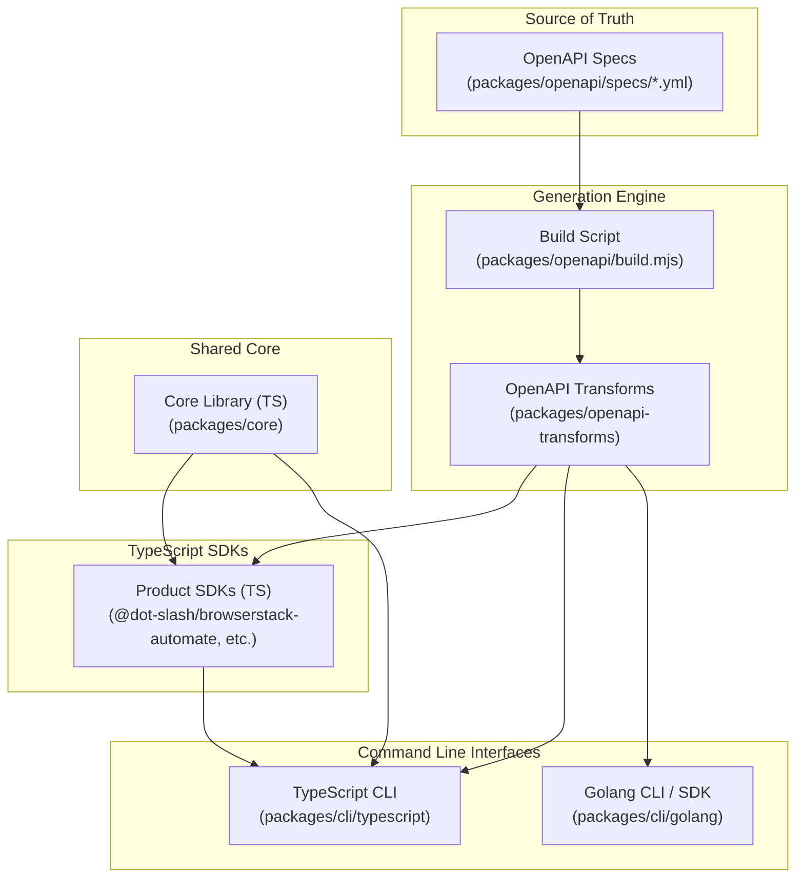

# Architecture

The BrowserStack Client SDK is designed with an OpenAPI-first approach, ensuring that all clients (TypeScript and Golang) and the CLI are consistently generated from a single source of truth.

## Component Architecture

The following diagram illustrates how the different components of the project interact and their dependency flow:

## Source of Truth: OpenAPI Specs

The project uses OpenAPI 3.x specifications to define all BrowserStack REST APIs.
- **Main Spec**: `openapi.yml` (bundled version of all core APIs).
- **Product Specs**: Individual specs for each product (e.g., `automate.yml`, `app-automate.yml`) are located in `packages/openapi/specs/`.

### CLI Metadata Extensions
We use custom OpenAPI extensions to define CLI-specific behavior directly in the YAML specs:
- `x-cli-resource`: Groups operations into a CLI resource (e.g., `projects`).
- `x-cli-action`: Defines the CLI action name for an operation (e.g., `list-projects`).

## OpenAPI Transforms (`packages/openapi-transforms`)

This package provides the core transformation engine that processes OpenAPI specs and generates code for different targets.

- **TypeScript Codegen**: Generates type-safe API clients using `openapi-fetch`. It handles complex response parsing and error handling.
- **Golang Codegen**: Generates native Go types and client methods, allowing for a high-performance, standalone Go client and CLI.
- **CLI Codegen**:
    - **TypeScript**: Generates Zod schemas for runtime argument validation and constant mappings for command routing.
    - **Golang**: Generates Go constants and command structures for routing.

## TypeScript CLI (`packages/cli/typescript`)

The TypeScript CLI is built using Node.js.
- **Modular Structure**: Each product has its own command definition file (e.g., `browserstack-automate.ts`).
- **Generated Dispatch & Validation**: Uses a centralized routing map (`ActionSchemaMap`) and Zod schemas generated from OpenAPI metadata (`packages/openapi-transforms/src/codegen/cli/typescript.ts`) to validate input flags and arguments at runtime before seamlessly dispatching the call to the corresponding client method.
- **Consistent Interface**: Command names and flags are derived directly from OpenAPI metadata, ensuring consistency across all BrowserStack products without manual `switch` statement boilerplate.

## Golang CLI (`packages/cli/golang`)

The Golang CLI provides a native binary experience.
- **Generated Core & Dispatch**: The core API client, types, constants, and the command dispatcher (`cli_dispatch.generated.go`) are generated from OpenAPI into `cli/golang/generated/`.
- **Automated Argument Mapping**: The generated `Dispatch` function automatically handles positional and query argument parsing (including `strconv` type conversions and multipart payloads) and routes the CLI inputs to the correct client method. This completely eliminates manual `if len(args)` and `switch` routing ladders.
- **Performance**: Designed for environments where a standalone binary is preferred or where Node.js is not available.

## Build Pipeline

The build process is automated via `packages/openapi/build.mjs`:
1. **Bundle & Validate**: OpenAPI specs are bundled and validated using `swagger-parser`. This step is crucial for resolving external `$ref` pointers (e.g., to `shared.yml`) into a single, valid `openapi.json` for downstream consumption.
2. **Generate Types**: TypeScript types are generated from the bundled spec using `openapi-typescript`. These provide the foundational interfaces used by the type-safe clients.
3. **Generate Clients**: Transform-based API clients are generated for both TypeScript and Go.
4. **Generate CLI Metadata**: Constants and schemas for the CLI are extracted and generated.
