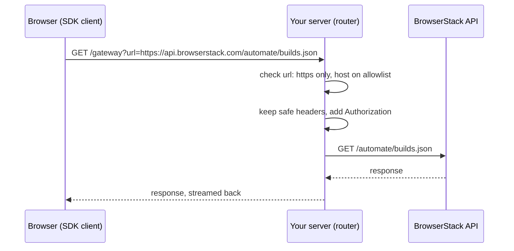

# Router

`@dot-slash/browserstack-router` lets a browser app use the BrowserStack SDK clients without the browser ever holding a BrowserStack access key. The browser sends each API request to your own server; the router, running there, checks where the request is going, adds your credentials and forwards it to BrowserStack.

```sh
npm install @dot-slash/browserstack-router
```

Requires Node.js 22 or later.

## Why it exists

BrowserStack's REST APIs use Basic auth with your username and access key. Calling them straight from a web page means shipping that key to every visitor, and browser requests to `api.browserstack.com` also run into CORS and BrowserStack's bot protection, which answers a browser User-Agent with an HTML challenge instead of JSON.

The router moves the call to your server. The browser only talks to your origin, the key stays on the server, and the upstream request goes out without the browser's identity attached.

## How a request flows



The target URL travels in the `url` query parameter. For each request the router:

1. Rejects it with `400` if `url` is missing or isn't a valid URL.
2. Rejects it with `403` unless the target uses `https:` and its hostname is exactly one of `allowedHosts`.
3. Copies only `accept`, `accept-language`, `content-type`, `if-none-match`, `if-modified-since` and `range` from the incoming request. Cookies, `authorization`, `user-agent`, `origin` and `sec-*` headers are dropped.
4. Sets `Authorization: Basic …` from the credentials you gave it.
5. Forwards the method and body (for anything other than `GET` and `HEAD`) and applies a timeout.
6. Streams the upstream status, headers and body back. `content-encoding` and `content-length` are removed, because `fetch` has already decoded the body.

If BrowserStack can't be reached, the caller gets `502 Bad Gateway`. If the request runs past its timeout, the caller gets `504 Gateway Timeout`.

## Server setup

`createGateway` returns a Node `(req, res, next)` handler, so it works with Express, Connect or a plain `http.createServer`:

```js
import express from "express";
import { createGateway } from "@dot-slash/browserstack-router";

const app = express();

app.use(
  "/gateway",
  createGateway({
    username: process.env.BROWSERSTACK_USERNAME,
    accessKey: process.env.BROWSERSTACK_ACCESS_KEY,
    allowedHosts: ["api.browserstack.com", "api-cloud.browserstack.com"],
  }),
);

app.listen(3000);
```

If your runtime speaks the Fetch API (`Request` in, `Response` out), use `createWebRouter` instead. It takes the same options and returns `(request: Request) => Promise<Response>`.

### Options

| Option | Default | Meaning |
|--------|---------|---------|
| `username` | required | BrowserStack username used for every forwarded request. |
| `accessKey` | required | BrowserStack access key used for every forwarded request. |
| `allowedHosts` | required | Hostnames the router may forward to. Must not be empty; matched exactly, with no wildcards. |
| `fetchFn` | global `fetch` | The `fetch` used for the upstream call, e.g. one wired to a proxy. |
| `defaultTimeout` | `30000` | Timeout in milliseconds when the caller doesn't ask for one. |
| `maxTimeout` | `60000` | Upper bound on a caller-requested timeout. |

A caller can ask for a different timeout with the `x-browserstack-timeout` header (milliseconds). Values above `maxTimeout` are capped to it.

### Which hosts to allow

Add the hosts for the clients your browser code uses:

| Client | Hosts |
|--------|-------|
| Automate, App Automate | `api.browserstack.com`, `api-cloud.browserstack.com` |
| Test Reporting & Analytics | `api-automation.browserstack.com`, `upload-automation.browserstack.com` |
| Test Management | `test-management.browserstack.com` |
| Accessibility | `api-accessibility.browserstack.com` |
| Website Scanner | `api-scanner.browserstack.com` |
| Screenshots, Local Testing | `www.browserstack.com`, `api-cloud.browserstack.com` |

The Test Reporting client's live ingestion calls (`collector-observability.browserstack.com`) won't work through the router, even with that host allowed. They authenticate with a per-build token, and the router always replaces `Authorization` with Basic auth. Report test results from the server instead.

## Browser setup

The SDK clients accept a `middleware` option. Add one that rewrites every request URL to point at your gateway:

```ts
import { AutomateClient } from "@dot-slash/browserstack-automate";

const automate = new AutomateClient({
  middleware: [
    (req, next) => next({ ...req, url: `/gateway?url=${encodeURIComponent(req.url)}` }),
  ],
});

const builds = await automate.getBuilds();
```

The client still builds the full `https://api.browserstack.com/...` URL, so the router sees the real target and can check it against `allowedHosts`. No credentials are passed to the client in the browser.

## What the router doesn't do for you

The router decides *where* a request may go. It doesn't decide *who* may send it, or *what* they may do once it gets there. Anyone who can reach your `/gateway` route can use your credentials against every allowed host, so put your own checks in front of it:

- **Authenticate callers.** Gate the route behind your app's login or session.
- **Limit methods.** If the browser only needs to read, refuse everything except `GET` and `HEAD` before the router runs.
- **Keep the allowlist small.** List only the hosts your app needs.
- **Rate-limit** the route like any other endpoint that spends someone's API quota.

`examples/tra-dashboard/server/app.ts` shows these together. Each signed-in user's credentials live in a server-side session behind an HttpOnly cookie. The gateway route accepts only `GET` and `HEAD` from the same origin, and a router is created per request with that user's credentials.

`examples/sample-server` is a minimal demo that takes credentials from request headers. It's handy for trying the router locally, but don't deploy that pattern: it sends the access key from the browser on every request.
